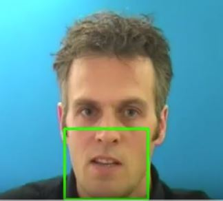
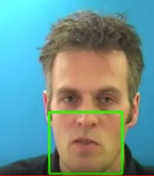

# Lip Reading in the Wild - AVSR


This repository contains the demo for the Audio Visual Speech Recognition System mentioned in the paper, [Lip Reading Sentences in the Wild](https://arxiv.org/abs/1611.05358). This network can be used for audio-visual speech recognition like lip reading sentences in the scenarios where audio is not present or corrupted.

### Structure of the code

This directory has the following code structure,

```
data/
demo_output/
dlib/
experiments/
model/
	was/
    input_fn.py
    model_fn.py
    utils.py
    training.py
    evaluation.py
misc/
train.py
search_hyperparams.py
synthesize_results.py
evaluate.py
download_grid_corpus.sh
```

Here is each ```model/``` file purpose:

- ```model/input_fn.py```: where you define the input data pipeline
- ```model/model_fn.py```: creates the deep learning model
- ```model/was/```: watch-attend-spell components
- ```model/utils.py```: utility functions for handling hyperparams / logging
- ```model/training.py```: utility functions to train a model
- ```model/evaluation.py```: utility functions to evaluate a model

### Demo

##### Facial landmark detection

First get ```shape_predictor_68_face_landmarks.dat``` file from [here](https://osdn.net/projects/sfnet_dclib/downloads/dlib/v18.10/shape_predictor_68_face_landmarks.dat.bz2/) and place it under ```dlib/``` directory

##### Download GRID Audio-Visual Speech Corpus

Run in terminal:

``` bash
$ sh download_grid_corpus.sh
```


##### Processing Visual Data

Run below script in terminal to process to get demo output of lip region cropped images of any video passed as an argument

``` bash
$ python prepare_data_demo.py -i data/id2_vcd_swwp2s.mpg -o demo_output/
```
Demo output [here](https://drive.google.com/drive/folders/1vON0G6a0X5a0JK017EQJwY9yzkkxenes)

<p align="center">
  
  
</p>

##### TODO

- Preparing input_pipeline using new tf.data API
- Training the Network
- Integrate audio modality within the existing network
